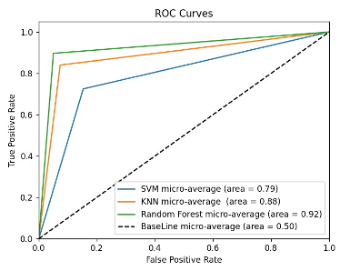

# NetTrafficAnalyzerML

The continuous growth of internet users has led to a massive volume of data flow on the Internet, resulting in an upsurge in online criminal activities. Cyber criminals use the anonymity offered by VPNs and Tor Browser to carry out sophisticated attacks on organizations. Therefore, it is crucial to closely monitor inbound/outbound network traffic to detect patterns indicative of suspicious behavior.

This repository contains the implementation of a machine learning solution that helps organizations classify network traffic as benign or suspicious. The solution can aid in the early detection of malware before an attack and the detection of malicious events during investigation after the attack.

## Data ##

The input to our algorithm is a CSV file containing over 80 network traffic features, such as Duration, Number of packets, Number of bytes, Length of packets, etc., calculated for both forward and backward network traffic flow.

## Models ##

We use Support Vector Machine (SVM), k-nearest neighbor (kNN), and Random Forest classifiers to predict whether the network traffic is from Tor, VPN, or belonging to normal traffic. We also include a dummy Baseline classifier that always predicts the most frequent class as the output.

## Performance Metrics ##
To measure the performance of our models, we use Accuracy, Precision, Recall, and F1 scores. We show the Confusion matrix and ROC curves for our models. The dataset has been split into 75% train and 25% test sets.

# Results #

## ROC Curve ##

The figure represents the micro-average ROC curves for all classification models developed in the project (Support Vector Machine, k-nearest neighbor, Random Forest, and Baseline). The Random Forest model has the highest true positive rate (0.92), followed by the kNN model (0.88) and SVM model (0.79).

## Performance Metrics Table ##
The table below shows a summary of all the performance scores (Accuracy, F1-Score, Precision, and Recall) of our implemented models (SVM, kNN, Random Forest, and Baseline). We can observe that the performance on the training set for all models is above 90%, which reflects good tuning of input features. Out of all the models implemented, Random Forest produces the scores with the highest accuracy (88.93%) followed by k-nearest neighbors (84.40%) and Support Vector Machines (60.10%). By comparing these scores with the baseline model, which has the lowest accuracy, we can say that our model’s performance is much better.

| Model                    | Train Accuracy | Test Accuracy | Train F1-Score | Test F1-Score | Train Precision | Test Precision | Train Recall | Test Recall |
|--------------------------|----------------|---------------|----------------|---------------|-----------------|----------------|--------------|-------------|
| Support Vector Machine | 92.06%         | 60.10%        | 93.17%         | 71.71%        | 93.57%          | 71.02%         | 92.86%       | 72.45%      |
| k-nearest neighbor      | 91.87%         | 84.40%        | 91.88%         | 84.45%        | 91.91%          | 84.55%         | 91.87%       | 84.40%      |
| Random Forest           | 99.33%         | 88.93%        | 99.33%         | 88.96%        | 99.34%          | 89.0%          | 99.12%       | 88.93%      |
| Baseline                 | N/A            | 31.22%        | N/A            | 14.85%        | N/A             | 9.75%          | N/A          | 31.22%      |

# How to use the project #
The code for the project can be found in the src directory. To run the project, follow the below steps:

- Install the required packages by running pip install -r requirements.txt.
- Run python nettrafficanalyzerml.py to preprocess tha data, train and evaluate the performance of the all the models.
Note: The Final_Datasets.csv directory contains the Network Packets dataset used in this project.

